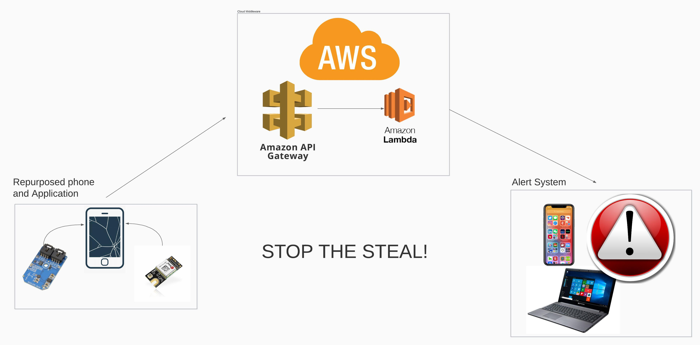
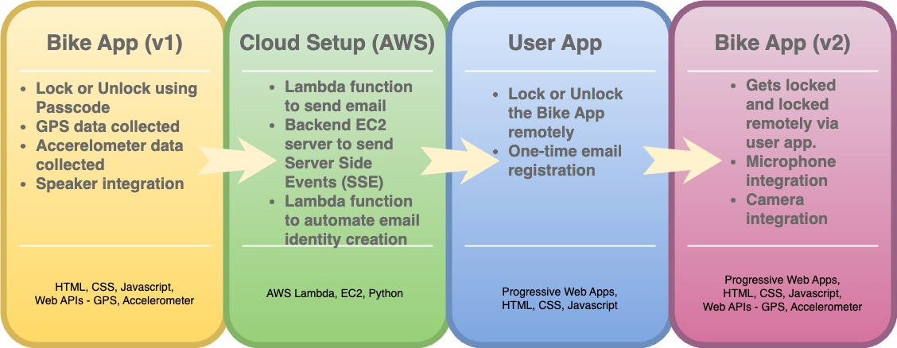

# Stop The Steal: Bike Anti Theft

## About The Project

### Motivation
1. **Tonnes of e-waste being generated in the form of phones**: The rapid advancement of technology and consumer demand for new devices contribute to the massive generation of electronic waste (e-waste). E-waste poses environmental challenges due to hazardous materials contained in electronic devices. By repurposing old phones as anti-theft devices, we can give them a second life and reduce the amount of e-waste sent to landfills. This approach aligns with the principles of sustainability and responsible consumption, promoting the reuse of existing resources.

2. **UCSD's bike theft problem**: Bike theft has become a significant issue on the UC San Diego (UCSD) campus, with a noticeable increase in recent years. Bike theft not only leads to financial loss for individuals but also disrupts campus life and affects the overall safety and security of the campus community. By utilizing old phones as anti-theft devices, we can develop a cost-effective solution to address this problem. These devices can serve as effective deterrents and help track stolen bikes, increasing the chances of recovery and discouraging potential thieves. Implementing such a solution demonstrates a commitment to improving campus security and enhancing the overall experience for students, faculty, and staff at UCSD.

### Abstract

Our research is focused on creating a highly effective anti-theft system for bicycles that leverages the advanced capabilities of old smartphones. The system operates in two modes: locked and unlocked. In unlocked mode, the user has complete freedom to use their bike without any limitations or notifications. However, when the user engages the lock mode, the smartphone device, equipped with sensors such as GPS and accelerometers, will begin monitoring the bike's location and movements. If the system detects any unauthorized movement, such as a thief attempting to steal the bike, a loud alarm will sound to alert nearby people. Simultaneously, the system will send a notification to the user's phone indicating the theft attempt and providing GPS coordinates of the bike's location. This will enable the user to contact the authorities and recover their stolen bike.

### Team Members
- Gagan Gopalaiah
- Akshay Prabhu
- Grishma Gurbani

### Elevator Pitch

[Slides of Elevator Pitch](https://)

### Project Charter

[Wiki Page on Project Charter](https://)

[PDF Version](https://)

### Milestone Report

[Wiki Page on Milestone Progress](https://)

[PDF Version](https://)

### Oral Update

[Slides of Oral Update](https://)

## Technical Documentation

### Repository Organization

The repository is organized as follows:

**./js** : Contains the code for the main bike application.

**./aws**: Includes the AWS Lambdas (serverless functions) responsible for sending emails and registering email identity.

**./backend**: Contains the backend Node.js server used as a middleware.

**./sounds**: Hosts the audio files that are played when motion is detected.

**./out**: Stores the files generated by JSDocs.

**./index.html**: Serves as the entry point for the bike application.

### Deployment Steps

#### Frontend Deployment

The frontend is currently hosted on GitHub Pages. To replicate the deployment process:

1. Fork this repository.
2. Navigate to the repository's settings.
3. Under the "Pages" section, select the option to deploy from a specific branch.
4. Choose the branch you want to deploy and save the settings.

#### Backend Deployment

1. Lambda Deployment - 
    - Go to the AWS Lambda dashboard and select "Create function".
    - Choose the "Author from scratch" option and specify the necessary specifications.
    - Copy and paste the code from the `lambda_email.py` file (located inside the **./aws** folder) into the code source window and save it.
    - Repeat the above steps for the `lambda_email_identity.py` code.

2. Middleware Deployment - 
    - The middleware code can be found in the server.js file located in the **./backend** folder.
    - Clone the repository and follow these steps to run the Node.js server:
    - Run `npm install` to install the necessary dependencies.
    - Run `node server.js` to start the server.
    - For improved security and best practices, consider setting up an Nginx or Apache reverse proxy server in front of the Node.js server and configure an SSL certificate for HTTPS support.

By following these steps, you can successfully deploy the frontend and backend components of the application.

### Architecture Diagram

### Development Cycle

## Demo

### Version 1 Demonstration

[Link to Demo](https://www.youtube.com/watch?v=NOQyXAkkuBU)

### Version 2 Demonstration

[Link to Demo](https://www.youtube.com/watch?v=NOQyXAkkuBU)

### Final Project Video

TBA: To be added by 6/12/2023

## Future Work